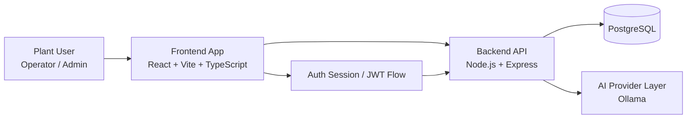
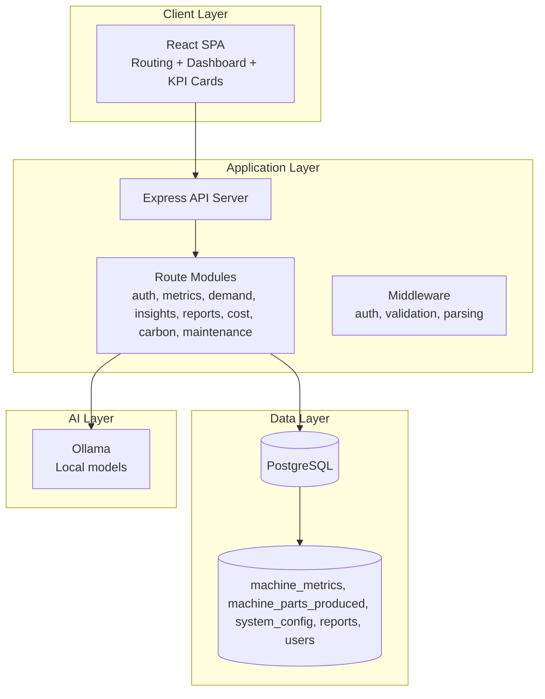
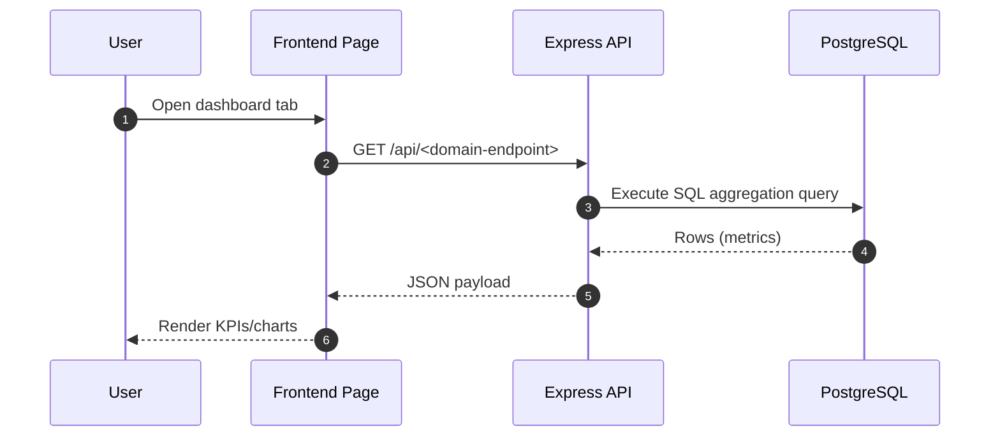
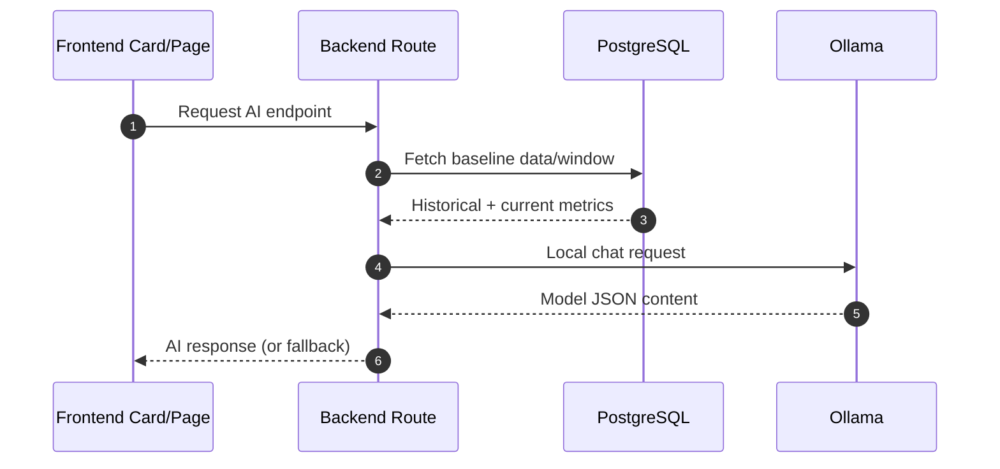
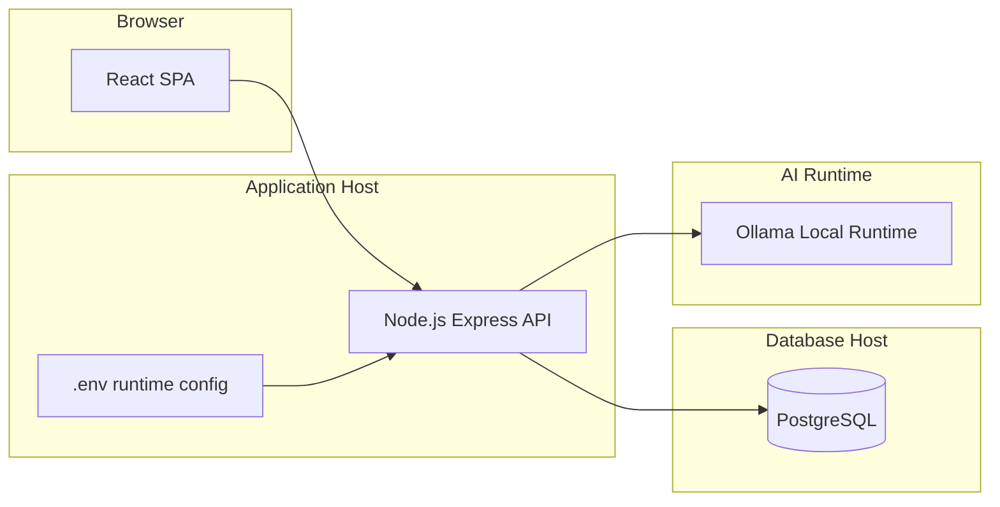

# Energy Intelligence Project Architecture

## 1. Purpose and Scope
This document defines the target architecture of the Energy Intelligence system and maps it to the current implementation.

System goals:
- Monitor industrial energy, production, quality, and demand in near real time.
- Provide analytics dashboards and KPI cards for plant operators.
- Support AI-assisted insights, forecasts, and recommendations.
- Provide a secure backend API with database-driven calculations.

## 2. High-Level Architecture (Context)

## 3. Container Architecture

## 4. Frontend Architecture

Core frontend structure:
- App bootstrap and routing: `frontend/src/main.tsx`, `frontend/src/App.tsx`
- Shared layout and navigation: `frontend/src/components/DashboardLayout.tsx`
- Reusable KPI visualization unit: `frontend/src/components/KPICard.tsx`
- Page modules: `frontend/src/pages/*`
- HTTP base config: `frontend/src/config/api.ts`
- API client wrapper: `frontend/src/services/apiClient.ts`

Frontend design pattern:
- Route-driven page composition.
- Polling-based live updates for selected cards/charts.
- Shared card components with variant-driven visual states.
- AI hints/suggestions exposed at card level (hover behavior on supported cards).

## 5. Backend Architecture

Backend entrypoints and layers:
- Server bootstrap: `backend/src/server.js`
- DB connection pool: `backend/src/db.js`
- Route modules under: `backend/src/routes/`

Route responsibilities (summary):
- auth/users: authentication and user management.
- machines/production/metrics: operational telemetry and KPI calculations.
- energy-output/power-quality/demand/cost/carbon: domain analytics endpoints.
- insights/reports/chat-assist: AI-driven narratives and intelligence generation.
- maintenance/config: maintenance and plant/system configuration.

API style:
- REST-style endpoint groups under `/api/*`.
- JSON request/response contracts.
- SQL-first deterministic calculations for core metrics.
- AI augmentation where configured, with fallback behavior when unavailable.

## 6. AI Provider Architecture (Ollama)

Provider flow:
1. Use Ollama local chat endpoint for AI generation.
2. If AI request fails or model output is invalid, return deterministic fallback where implemented.

Relevant backend modules:
- `backend/src/routes/chatAssist.js`
- `backend/src/routes/insights.js`
- `backend/src/routes/reports.js`
- `backend/src/routes/demand.js`

Typical environment variables:
- `OLLAMA_BASE_URL`, `OLLAMA_MODEL`
- Timeout and token controls (route-specific)

## 7. Key Runtime Data Flows

### 7.1 Dashboard KPI Flow

### 7.2 AI-Assisted Prediction Flow

## 8. Deployment View

## 9. Non-Functional Architecture Notes

Scalability:
- DB pooling is enabled in `db.js`.
- Frontend polling intervals should be tuned per endpoint criticality.

Reliability:
- Health endpoint available at `/api/health`.
- AI-enabled endpoints should preserve deterministic fallback paths for resilience.

Security:
- Use authenticated routes for protected plant data and admin pages.

Observability:
- Add structured request logging and latency tracking per route.
- Add AI provider success/error counters and timeout metrics.

## 10. Next Architecture Enhancements
- Introduce service-layer abstraction between routes and SQL logic for clearer domain boundaries.
- Add centralized AI client module to avoid duplicated provider logic across routes.
- Add caching for expensive analytics endpoints and repeated AI requests.
- Add architecture decision records (ADRs) for local inference and fallback policy.

## 11. Reference Mapping Section (Fill with your sample)
Paste your reference architecture sections here and map each section to this document:
- Reference section title -> matching section in this file.
- Required diagram style -> Mermaid/C4/BPMN adaptation.
- Required naming conventions -> update terms and labels globally.
